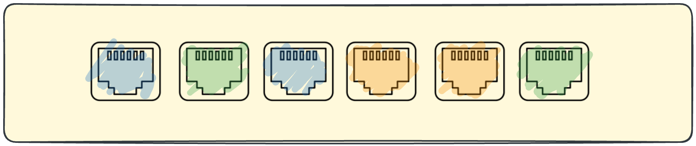
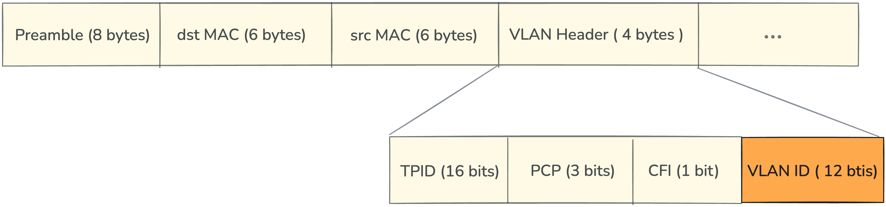
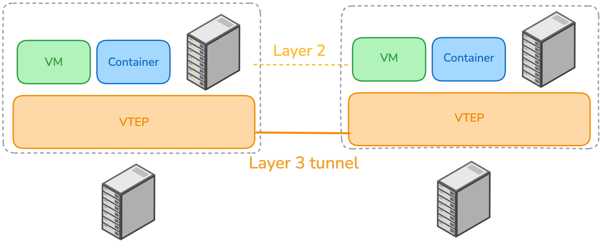
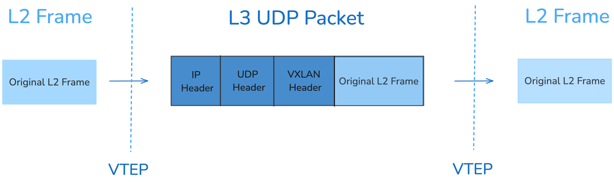
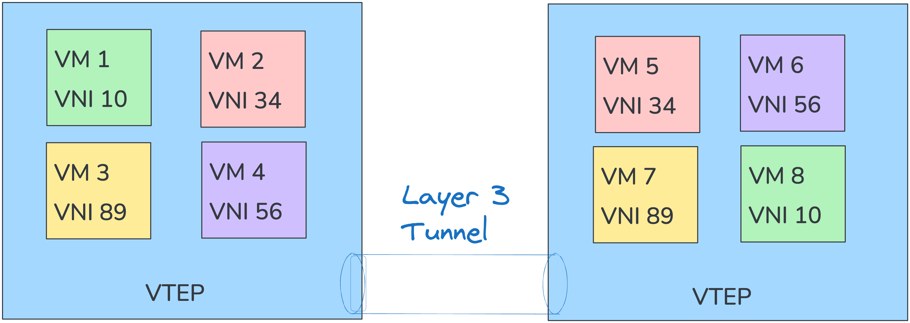
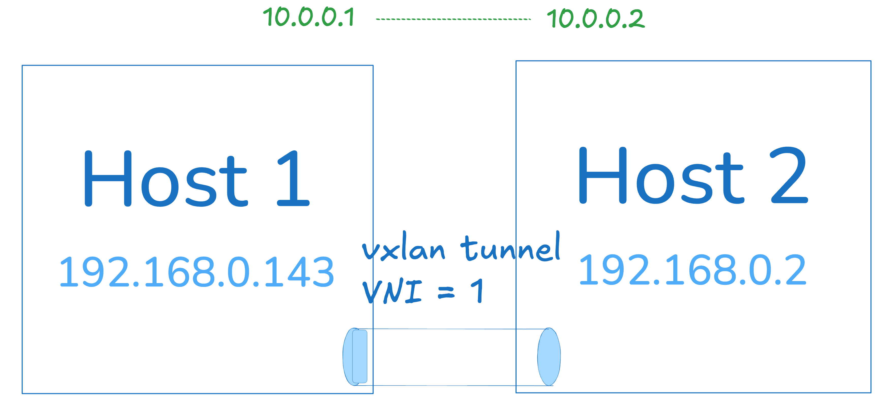
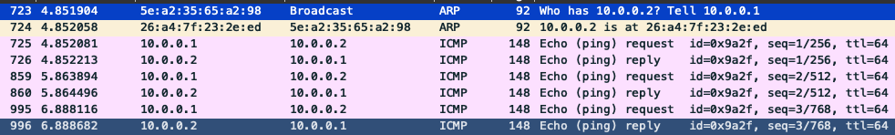
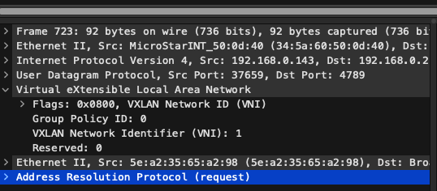

import { Tabs, TabItem } from '@astrojs/starlight/components';

## 前言
前陣子工作時看到同事在研究如何建立跨 az 的 Kubernetes cluster，

那時候第一次聽到 **VXLAN** 這個詞彙。

今天我們會從 VLAN 這個前身開始介紹，

並說明為何會有後續的 VXLAN 出現。

本文參考了網路資源並經過與 GPT 討論後撰寫，

若有不夠精準或錯誤的地方，歡迎指正！

## VLAN 簡介

[VLAN](https://en.wikipedia.org/wiki/VLAN)，全名 Virtual LAN（虛擬區域網路），是在 Layer 2 網路上劃分邏輯區域的方法。

想像一間公司裡，有工程部、財務部、行銷部，

我們可以透過 VLAN 將他們分開，各自形成自己的小網路，彼此的 broadcast 不會互相干擾。

每個小網路會有自己的 VLAN ID， 如以下來自維基百科的圖片 


VLAN 有分為標記跟未標記兩種，

主要是實作方式上的差異。

未標記指的是直接在 port 上標示這個屬於哪組 VLAN，



已標記則是指在 Ethernet Frame Header 上帶上 VLAN ID， 用來判斷這個封包屬於哪個 VLAN，



但它有個明顯的限制， **最多只能有 4096 個 VLAN ID**， 因為 ID 只有 12 個 bits。

小型企業可能不會有問題，但對於大型企業或是資料中心來說，4096 個 VLAN ID 是不足的！

:::note
一般描述封包格式時，不會稱之為 VLAN header  

而是稱為 802.1Q header

802.1Q 是 IEEE 的一個標準，定義了 VLAN 標記的格式和行為。
:::
## VXLAN 簡介
VXLAN，全名是 Virtual eXtensible LAN，是 VLAN 的延伸。

它不是在 Layer 2 劃分，而是把 Layer 2 的 Frame 封裝在 Layer 3 的封包內

來達成貌似在同一個網段的效果

雖然他最開始設計的場景是 VM-to-VM 的連線

但後來也被廣泛應用在 Kubernetes 的 Pod 之間的 overlay 網路

下圖是一個簡單的概念圖



在開始之前先介紹一些常見的名詞
* **VNI**:  
    VXLAN Network Identifier，類似 VLAN ID， 但它有 24 bits 
* **VTEP**:  
    VXLAN Tunnel End Point
    負責將 Layer 2 的 Frame 包裝成 Layer 3 的封包，以及將 Layer 3 的封包解包成 Layer 2 的 Frame。
* **VXLAN Segment**:  
    相同的 VNI 即為同一個 VXLAN Segment，不同的 VXLAN segment 無法透過 VXLAN 互通

雖然 VTEP 可以傳遞 VM 或是 Container 的封包，

**但本文為求簡化, 統稱這些透過 VXLAN 連線的機器為 VM。**

## VXLAN 運作原理

前面提到 VXLAN 是把 Layer 2 的 Frame 封裝在 Layer 3 的封包內。

如下圖, 左邊是最原始的 VM 發出的 L2 Frame，

透過 VTEP 將其封裝成 L3 的封包，

並透過 UDP 傳送到另一個 VTEP。

UDP 的 payload 裡包含原本的 L2 Frame 加上 VXLAN  Header 。

VXLAN Header 共有 8 bytes，包含 24 bits 的 VNI 以及一些 flag。

當另一個 VTEP 收到這個封包後，會將它解包回原本的 L2 Frame，

最後再傳送給另外一個接收的 VM。




然而，這樣的封裝帶來了一個缺點，

UDP header、VXLAN header 以及原本的 L2 Frame 都被包進去，

這些額外的 header 以及原本的 L2 header 總共是 50 個 bytes， 

但是 VTEP 間的 MTU 還是只有 1500 bytes，

導致必需縮減原本的 L2 Frame 的大小。

透過 VXLAN 傳遞的封包通常有 MTU 1450 的限制，

這也是除了拆包解包外的另外一個 overhead。

## 應用場景
以 RFC 7348 裡的例子來說明 VXLAN 的應用場景，

當有兩台 Server, 上面分別跑著 4 台 VM，

不論這兩台 Server 位於何處, 只要在 IP 層互通，

那在那兩台 Server 上的 VM 只要 VNI 相同，就可以透過 VXLAN 連線。



回到最開始提到的 cross az kubernetes cluster，

只要我們的 nodes 在 IP 層互通，

便可透過 VXLAN 來達成 nodes 上 Pod-to-Pod 的互通。

:::caution

若 node 間經過外網，

那 pod 之間的通訊需要加密。

:::

## 實戰

這次的實戰我們會在兩台機器上面透過 VXLAN 來連線

目標架構圖如下：

兩台機器的 ip 分別為 `192.168.0.143` 以及 `192.168.0.2`

ip 不必與我相同, 只要確保兩台機器之間可以透過 ip 互通



而我們會直接設定 VXLAN device 的 ip 為 `10.0.0.1` 和 `10.0.0.2`

目標是 Host 1 上的 `10.0.0.1` 以及 Host 2 上的 `10.0.0.2` 能夠互通。

或許你會好奇 VM 呢？

其實只要兩台機器能透過 VXLAN 的 ip 互通即可，

剩下的是本機路由的問題。

下面會分成 Host1 以及 Host2 兩個 tab ，

兩邊步驟完全相同，

只差在 Host1 的 ip 是 `192.168.0.143`，

而 Host2 的 ip 是 `192.168.0.2`。

<Tabs>
<TabItem label="Host 1">
#### 1. 確認連線使用的 device 
因為第二步創建 device 時需要用到，

所以我們第一步先確認一下與對方的連線使用的 device 是哪一個，

也就是擁有 `192.168.0.143` 這個 ip 的 device。

這邊為 eth0。
```sh
ip a
    eth0: <BROADCAST,MULTICAST,UP,LOWER_UP> mtu 1500 qdisc mq state UP group default qlen 1000
    inet 192.168.0.143/24 brd 192.168.0.255 scope global eth0

```
#### 2. 創建 vxlan device 
device 的名稱可以自訂, 這邊取名為 vxlan0。

id 代表 VNI。

兩個 host 的 VXLAN device id 必須相同, 否則無法互通。

remote 指向另一端的 VTEP 的 ip。

VXLAN 所使用的 port 是 `4789`。

dev 則是前一步確認的 device。

```sh
sudo ip link add vxlan0 type vxlan id 1 remote 192.168.0.2 dstport 4789 dev eth0
```

:::note
雖然我們這邊 remote 的 VTEP 只有設定一台，

但實務上會設定多台。

:::

#### 3. 設定 vxlan device 的 ip 並啟動

此處設定 mask 為 24, 代表此 VTEP 可分配的 IP 範圍為 10.0.0.1 到 10.0.0.254，共 254 個 IP。

```sh
sudo ip addr add 10.0.0.1/24 dev vxlan0
sudo ip link set vxlan0 up
ip a
17: vxlan0: <BROADCAST,MULTICAST,UP,LOWER_UP> mtu 1450 qdisc noqueue state UNKNOWN group default qlen 1000
    link/ether 5e:a2:35:65:a2:98 brd ff:ff:ff:ff:ff:ff
    inet 10.0.0.1/24 scope global vxlan0
       valid_lft forever preferred_lft forever
```

</TabItem>

<TabItem label="Host 2">
#### 1. 確認連線使用的 device 
因為等等創建 device 時需要用到，

所以我們先確認與對方連線使用的 device 是哪一個，

也就是擁有 `192.168.0.2` 這個 ip 的 device。

此處為 eth0。
```sh
ip a
    eth0: <BROADCAST,MULTICAST,UP,LOWER_UP> mtu 1500 qdisc mq state UP group default qlen 1000
    inet 192.168.0.2/24 brd 192.168.0.255 scope global eth0

```
#### 2. 創建 vxlan device 
device 的名稱可以自訂, 這邊取為 vxlan0。

id 代表 VNI。

兩個 host 的 id 必須相同， 否則無法互通。

remote 指另一端的 VTEP 的 ip。

VXLAN 所使用的 port 是 4789。

dev 則是前一步所確認的 device。

```sh
sudo ip link add vxlan0 type vxlan id 1 remote 192.168.0.143 dstport 4789 dev eth0
```

:::note
雖然我們這邊 remote 的 VTEP 只有設定一台，

但實務上會設定多台。

:::

#### 3. 設定 vxlan device 的 ip 並啟動

此處設定 mask 為 24, 代表此 VTEP 可分配的 IP 範圍為 10.0.0.1 到 10.0.0.254，共 254 個 IP。

```sh
sudo ip addr add 10.0.0.2/24 dev vxlan0
sudo ip link set vxlan0 up
ip a
46: vxlan0: <BROADCAST,MULTICAST,UP,LOWER_UP> mtu 1450 qdisc noqueue state UNKNOWN group default qlen 1000
    link/ether 26:a4:7f:23:2e:ed brd ff:ff:ff:ff:ff:ff
    inet 10.0.0.2/24 scope global vxlan0
       valid_lft forever preferred_lft forever
```

</TabItem>
</Tabs>


---

Host1, Host2 都完成後我們就可以來 do re mi so 了！

```sh
# 在 Host 1 上 ping Host 2
ping 10.0.0.2

# 在 Host 2 上 ping Host 1
ping 10.0.0.1
```

理論上完成到這裡就成功了！


#### 4. 抓包

如果你有興趣，可以透過 tcpdump 來抓包。

這邊簡單示範 Host 1 (10.0.0.1) ping Host 2 (10.0.0.2) 的封包流程。



可以看到最開始的 ARP request，

Host 1 詢問誰有 `10.0.0.2` 的 Mac Address，

這個 arp request 發出去的封包細節如下圖，

UDP 包含 VXLAN 的 header ，

而 VXLAN 中又封裝 Ethernet frame, 裡面是最原始的 ARP request。

當這個 UDP 封包送到 Host 2 的時候，

經過 VTEP 把它解封成原本的 ARP request。



#### 5. 透過 VXLAN 連通兩個 host 的 Container

礙於篇幅，

這邊不示範怎麼做，

畢竟 container 又是另外一個主題，

但是如果你有興趣的話也可以自己嘗試，

要做的步驟如下：

1. 完成前面兩個 Host 的 vxlan 設定，
   這次不需要設定他們的 ip 網段，
   只需要設定 remote VTEP 的 ip 以及 vxlan id 即可。
   之前需要 `ip addr add` 是為了簡單 ping 通。

2. 兩個 host 上都要創建 docker network，
   例如 `10.0.0.0/24`。

3. 將第一步創建的 vxlan device 連接到 docker network 創立的 bridge 上。

4. 在兩個 host 上創建 container，
   指定 ip 為第 2 步創建的 docker network 內的網段, 像是 `10.0.0.10`，
   兩個 container 的 ip 不能重複。

5. 大功告成！可以在一個 container 內 ping 另外一個 host 上的 container！

:::note
必須創建 docker network 的原因是若要指定 container IP，必須在 user created network 的網段內，

且自行創建網段可控制想要的 IP 範圍。
:::

:::tip
在容器內做網路實驗時，可以使用 nicolaka/netshoot 這個 image 

裡面包含了常見的網路工具。
:::

:::caution
因 container 不知道自己的封包會經過 vxlan device，

其 veth 的 MTU 仍然是 1500 bytes，

可能導致連線問題, 像是 iperf3 測速為 0。
:::


## Reference
* https://www.cnblogs.com/bakari/p/11264520.html
* https://datatracker.ietf.org/doc/html/rfc7348#section-1
