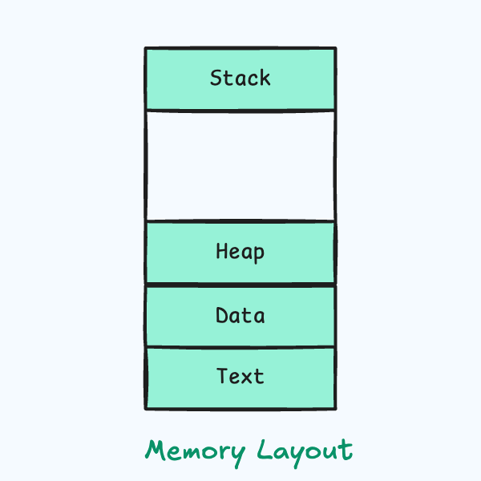
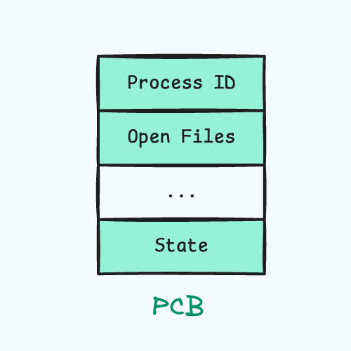
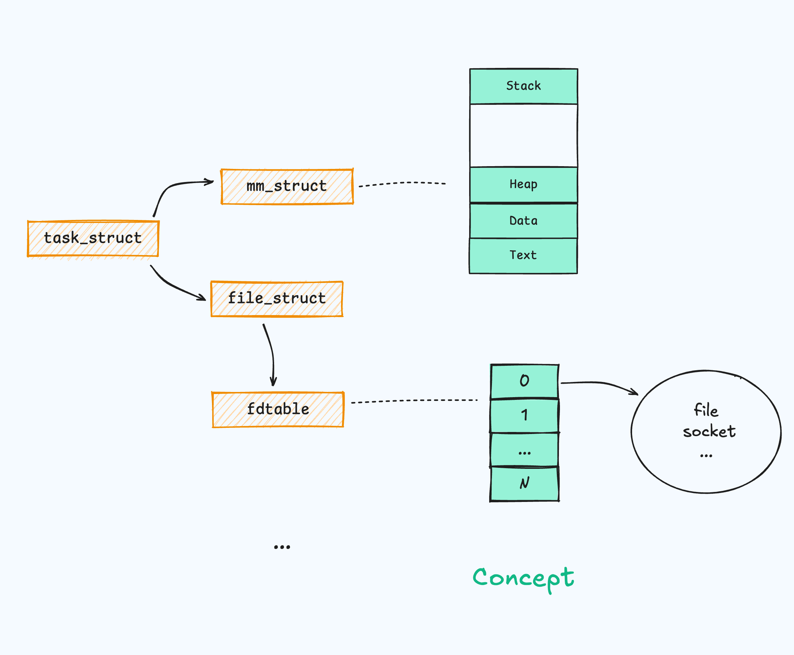
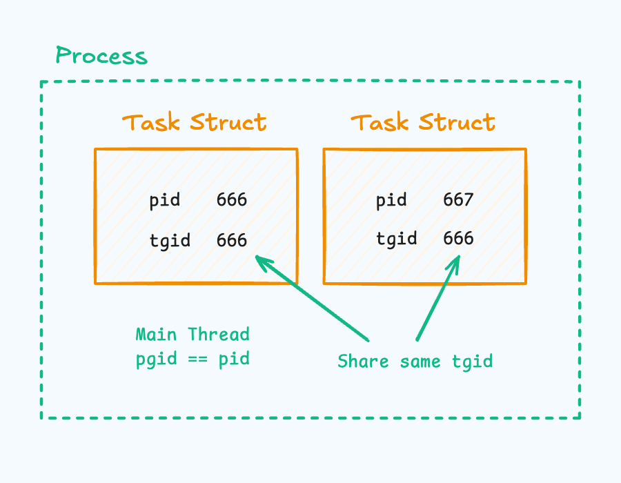
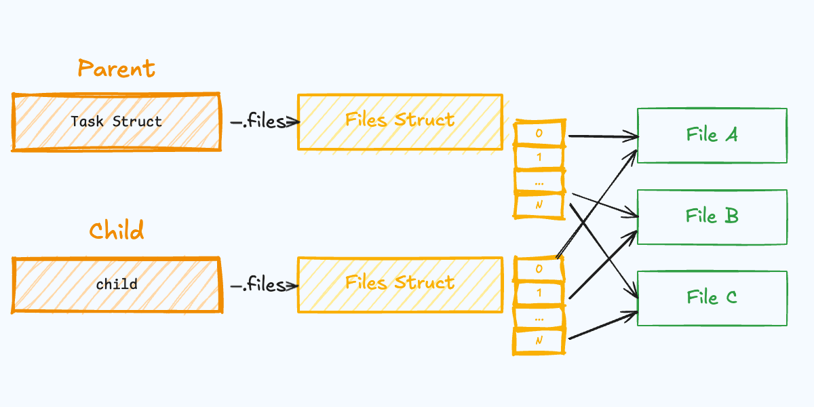
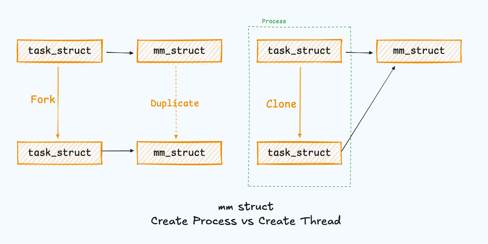

---
title: 淺入淺出 Process and Thread
---

import {Aside} from "@astrojs/starlight/components";

## 前言
這篇文章主要想介紹在 Linux 裡面

Process 到底長的什麼樣，Thread 又長什麼樣

在開始之前先列出一些自己曾經的疑惑

這篇文章主旨在回答以下問題

*  Process 跟 Thread 的關係是什麼 ?
*  Kernel Threads 是什麼

這篇文章<span style="color:rgb(255, 0, 0)">不會</span>提到以下主題，會在其他文章中提到

*  Linux 如何 schedule task
*  Virtual Memory 的組成
*  Namespace, Cgroup


## Review
在開始之前我們先複習一下基本的 OS，

Process 簡單說就是執行中的 Program，

除了指令還包含了一些額外的資源像是變數的值，打開的檔案等等，

並且由 OS 提供了一定程度的虛擬化，包含 Processor ， Memory Address Space，

讓 Process 覺得自己獨佔了所有資源。




而 OS 內部用來記錄這個 Process 現在的 State 則稱為 Process Control Block (PCB)




而 Thread 是 CPU 執行的最小單位

所以每個 Process 至少都會包含一個 Thread，第一個 Thread 也稱為 Main Thread

而 Thread 因為是 CPU 執行的最小單位

所以每個 Thread 也都有自己的 Program Counter 以及 Stack

<span style="color:rgb(255, 0, 0)">只是同一個 Process 內會有獨立的 Virtual Memory</span>

這些記憶體是所有同 Process 的 Thread 共享。  


## Task.. ?

複習完基本的 Process 以及 Thread 後

我們來看他們在 Linux 裡面長什麼樣子！

在 Linux 裡面，他們的分界線有點模糊

而且他們其實都是由同一種 `struct task_struct` 所表示

以下面的程式碼簡介為例


```c
// /include/linux/sched.h
struct task_struct {
	struct fs_struct		*fs;

	/* Open file information: */
	struct files_struct		*files;
	struct mm_struct *mm;
	pid_t				pid;
	pid_t				tgid;
}


// 用來表示 memory address space
// /include/linux/mm_types.h
struct mm_struct {
	unsigned long start_code, end_code, start_data, end_data;
	unsigned long start_brk, brk, start_stack;
	unsigned long arg_start, arg_end, env_start, env_end;
	...
}

// 用來表示 file system 的位置，用戶等等
// /include/linux/fs_struct.h
struct fs_struct {
	int users;
	spinlock_t lock;
	seqcount_spinlock_t seq;
	int umask;
	int in_exec;
	struct path root, pwd;
}

// 用來表示這個 task 打開的檔案
// /include/linux/fdtable.h
struct files_struct {
	...
	struct fdtable fdtab;
};

```


以上述程式碼為例，可以簡單畫出像是底下的架構

左邊是實際的 struct 關係，右邊對應到我們平常耳熟能詳的理論

像是 Process Memory，File Descriptor Tables，

當然還有很多細節為了圖片簡潔被省略。





single thread 就只會有 1 個 task struct，

multithread 的 process 當然就會有多個 task struct，

比方說你額外創建了一個 thread 就總共會有 2 個 task_struct，

第一個是代表 Main Thread 的，第二個是代表額外創建的 Thread。

通常我們會用 pid 來表示一個 Process 的 ID，multithread 的 process 也會 share 同一個 pid，

在上面的 task_struct 中也確實有 pid 這個欄位，<span style="color:rgb(255, 0, 0)">但是這個 pid 其實並不是 process id</span>，

而是標示 task_struct 的 id，也就是說同個 process 內的 thread 會有不一樣的 pid，

因為他們是不同的 task_struct，而他們 share 的 ID 為 **thread group id** (tgid)。

見下圖，因為沒有真正代表 "Process 這個概念的 Object"，所以用虛線框框表示。



>在 system call **getpid** 中，實際上回傳的就是 task 的 tgid。
>
>```c
>SYSCALL_DEFINE0(getpid)
  >{
>	return task_tgid_vnr(current);
 > }
>```
> 關於更多為什麼 pid 是拿來區分 task 可以參考這篇[文章](https://unix.stackexchange.com/questions/364660/are-threads-implemented-as-processes-on-linux)
> 

<Aside>
在 ps 指令中預設只會 output Main thread
 
可以透過 `-L` 來將 thread 包含進來
</Aside>

## Process 是如何創建的 ?

上面做了一些簡單的介紹，

也提到 "Process" 或是 "Thread" 都是以 task 的形式存在於內核，

但為了區分他們的差異我們還是分別介紹他們出生的流程。

第一個 Process 通常為 **init** ，並由他直接或間接將其他 process 創建出來，

可以透過 `pstree` 看看你主機上面的族譜。

要創建一個 process 通常都是通過 system call **fork**。

fork 後就會有家長跟小孩的區別，用 return 的 pid 來判斷當前是家長還是小孩，

若為 0 則為 child process，否則為 parent process。

可以參考以下簡單 fork 後 hello world 的範例。

```c
#define _GNU_SOURCE
#include <stdio.h>
#include <sys/types.h>
#include <unistd.h>

int main() {
  pid_t pid = fork();

  if (pid < 0) {
    // Fork failed
    perror("Fork failed");
    return 1;
  } else if (pid == 0) {
    // Child process
    printf("Hello world from the child process! PID: %d\n", getpid());
  } else {
    // Parent process
    printf("Hello world from the child process! PID: %d\n", getpid());
  }

  return 0;
}
```


接著就來到我們的 system call 部分，透過 `strace` 可以看到實際呼叫的 syscall 為 clone

```shell
$ strace ./test-fork
clone(child_stack=NULL, flags=CLONE_CHILD_CLEARTID|CLONE_CHILD_SETTID|SIGCHLD, child_tidptr=0x7a947370ca10)

```

```c
SYSCALL_DEFINE5(clone, unsigned long, clone_flags, unsigned long, newsp,
		 int __user *, parent_tidptr,
		 int __user *, child_tidptr,
		 unsigned long, tls)
#endif
{
	struct kernel_clone_args args = {
		.flags		= (lower_32_bits(clone_flags) & ~CSIGNAL),
		.pidfd		= parent_tidptr,
		.child_tid	= child_tidptr,
		.parent_tid	= parent_tidptr,
		.exit_signal	= (lower_32_bits(clone_flags) & CSIGNAL),
		.stack		= newsp,
		.tls		= tls,
	};

	return kernel_clone(&args);
}
```

接著就進入 kernel_clone 以及 copy_process 的部分，

copy 完成後就會喚醒這個新生兒 🥰

讓他可以被 schedule 到，關於 schedule 的細節會在其他篇文章中提到。

```c
// /kernel/fork.c
pid_t kernel_clone(struct kernel_clone_args *args)
{
	struct pid *pid;
	struct task_struct *p;
	pid_t nr;

	...

	p = copy_process(NULL, trace, NUMA_NO_NODE, args);

	if (IS_ERR(p))
		return PTR_ERR(p);


	pid = get_task_pid(p, PIDTYPE_PID);
	nr = pid_vnr(pid);

	...

	wake_up_new_task(p);

	...
	
	return nr;
}
```


copy process 會先透過 dup_task_struct 申請一個新的 task struct

並複製原來的 process 。

此時新的 task struct 裡面的 pointer 像是 files，mm，fs 等等都還是跟 parent 的值一樣。


```c
// /kernel/fork.c
struct task_struct *copy_process(
					struct pid *pid,
					int trace,
					int node,
					struct kernel_clone_args *args)
{
	int pidfd = -1, retval;
	struct task_struct *p;
	const u64 clone_flags = args->flags;
	
	...
	
	// 分配一個新的 task struct，並設定 stack 等等
	p = dup_task_struct(current, node);

	...
	
	

```

但 Process 之間是獨立的，只能 "複製" parent 的資源而不是直接使用 parent 的。

就會將重要的資源單獨拉出來複製，像是 parent virtual memory 裡面的所有東西

打開的所有檔案等等，對細節感興趣的讀者可以直接去看原始碼，

這邊為求簡單只會展示 copy_files

```c
// /kernel/fork.c

struct task_struct *copy_process(
					struct pid *pid,
					int trace,
					int node,
					struct kernel_clone_args *args)
{
	...
	
	retval = copy_files(clone_flags, p, args->no_files);
	if (retval)
		goto bad_fork_cleanup_semundo;
	retval = copy_fs(clone_flags, p);
	if (retval)
		goto bad_fork_cleanup_files;
	retval = copy_sighand(clone_flags, p);
	if (retval)
		goto bad_fork_cleanup_fs;
	retval = copy_signal(clone_flags, p);
	if (retval)
		goto bad_fork_cleanup_sighand;
	retval = copy_mm(clone_flags, p);
	if (retval)
		goto bad_fork_cleanup_signal;
	retval = copy_namespaces(clone_flags, p);
	if (retval)
		goto bad_fork_cleanup_mm;
	retval = copy_io(clone_flags, p);
	if (retval)
		goto bad_fork_cleanup_namespaces;


```

```c
// /kernel/fork.c

static int copy_files(unsigned long clone_flags, struct task_struct *tsk,
		      int no_files)
{
	struct files_struct *oldf, *newf;
	int error = 0;

	/*
	 * A background process may not have any files ...
	 */
	oldf = current->files;
	if (!oldf)
		goto out;

	if (no_files) {
		tsk->files = NULL;
		goto out;
	}

	if (clone_flags & CLONE_FILES) {
		atomic_inc(&oldf->count);
		goto out;
	}

	// 分配新的 files structure 並且將舊的 files 的欄位複製過去
	newf = dup_fd(oldf, NR_OPEN_MAX, &error);
	if (!newf)
		goto out;

	tsk->files = newf;
	error = 0;
out:
	return error;
}
```

在這邊用上面 copy_files 的例子畫個概念圖來描述複製資源是什麼個概念

也因為新 process 的 files_struct 底下指到的檔案一樣

如果你將 parent process 的 stdout redirect 到某個檔案

他的 child process 的 stdout 也會是那個檔案。 



> 若對圖片裡的 Files Struct, fdtable 這個概念不熟可以參考 Advanced Programming in Unix Environment Ch3: File I/O

## Thread 是如何創建的 ?

通常我們創建 thread 會使用 pthread_create 這個函數，

詳細使用方法就不在這邊介紹，只要知道我們可以傳遞一個想要 thread 執行的 function 即可執行。


```c
#define _GNU_SOURCE
#include <pthread.h>
#include <stdio.h>
#include <unistd.h>

void *thread_function(void *arg) {
  printf("Thread ID: %d\n", gettid());
  return NULL;
}

int main() {
  pthread_t thread;
  if (pthread_create(&thread, NULL, thread_function, NULL) != 0) {
    perror("Thread creation failed");
    return 1;
  }

  pthread_join(thread, NULL);
  printf("Main thread ID: %d\n", gettid());
  return 0;
}

```

接著透過 `strace` 來偷看他實際呼叫的 system call

```shell
$ strace ./test_thread
...
clone3({flags=CLONE_VM|CLONE_FS|CLONE_FILES|CLONE_SIGHAND|CLONE_THREAD|CLONE_SYSVSEM|CLONE_SETTLS|CLONE_PARENT_SETTID|CLONE_CHILD_CLEARTID...
...
```

可以看到他實際上呼叫的是 clone3，並且帶入了玲琅滿目的 FLAGS

在 clone3 的一開始將 userspace 提供的 flag 複製到 kernel space

之後一樣呼叫了 kernel clone

**這邊可以看出實際上創造 Process 以及 Thread 最大的不同在傳入的 flag 不一樣**

clone 以及 clone3 在這邊差別不大

```c
// /kernel/fork.c

SYSCALL_DEFINE2(clone3, struct clone_args __user *, uargs, size_t, size)
{
	int err;

	struct kernel_clone_args kargs;
	pid_t set_tid[MAX_PID_NS_LEVEL];

	kargs.set_tid = set_tid;

	err = copy_clone_args_from_user(&kargs, uargs, size);
	if (err)
		return err;

	if (!clone3_args_valid(&kargs))
		return -EINVAL;

	return kernel_clone(&kargs);
}
```

這些 flags 的用處主要體現在複製 task_struct 的欄位，

以下舉 copy_files 以及 copy_mm 兩個函數為例子，

雖然上面已經有 copy_files 的 code 但還是再放一次造福懶人。 

```c
// /kernel/fork.c

static int copy_files(unsigned long clone_flags, struct task_struct *tsk,
		      int no_files)
{
	struct files_struct *oldf, *newf;
	int error = 0;

	/*
	 * A background process may not have any files ...
	 */
	oldf = current->files;
	if (!oldf)
		goto out;

	if (no_files) {
		tsk->files = NULL;
		goto out;
	}

	if (clone_flags & CLONE_FILES) {
		atomic_inc(&oldf->count);
		goto out;
	}

	newf = dup_fd(oldf, NR_OPEN_MAX, &error);
	if (!newf)
		goto out;

	tsk->files = newf;
	error = 0;
out:
	return error;
}

```

若傳入的參數有帶入 CLONE_FILES，

則會複用舊的 task_struct 的 files_struct 而不是複製。

下面再看一個 copy_mm 的 function

```c
// /kernel/fork.c

static int copy_mm(unsigned long clone_flags, struct task_struct *tsk)
{
	struct mm_struct *mm, *oldmm;
	
	...

	tsk->mm = NULL;
	tsk->active_mm = NULL;
	
	oldmm = current->mm;
	if (!oldmm)
		return 0;

	if (clone_flags & CLONE_VM) {
		mmget(oldmm);
		mm = oldmm;
	} else {
		mm = dup_mm(tsk, current->mm);
		if (!mm)
			return -ENOMEM;
	}

	tsk->mm = mm;
	tsk->active_mm = mm;
	sched_mm_cid_fork(tsk);
	return 0;
}

```

在 copy_mm 中，若有傳入 CLONE_VM，則不會複製 mm_struct，

這邊因為 Thread 是共用 Address Space ，所以不需要複製。

<Aside>
在 copy_mm 內也有實作 copy on write ，篇幅原因就省略這個部分。
</Aside>



最後回答到我們最上面的兩個問題

1. Process 跟 Thread 的關係是什麼 ?
	>   在 Linux 中 Process 跟 Thread 其實都是 task struct，只是創建時帶了不同的 Flag 來決定一些性質例如 Virtual Memory 該不該共享，打開的檔案該不該共享等等。Task struct 裡面封裝了非常多資源，礙於篇幅只有簡單介紹一些。
2. Kernel Thread 是什麼
	>   Kernel 也有一些 daemon task 負責常駐處理非常重要的任務比方說 softirq, swap memory 等等，通常大家會稱之為 Kernel Thread，**因為其沒有獨立的 Virtual Memory**，也因此他的 task 的 mm_struct 為 NULL，在上面的 copy_mm 其實有檢查 mm 是否為 NULL，本意就是在判斷複製的是否為 Kernel Thread。


