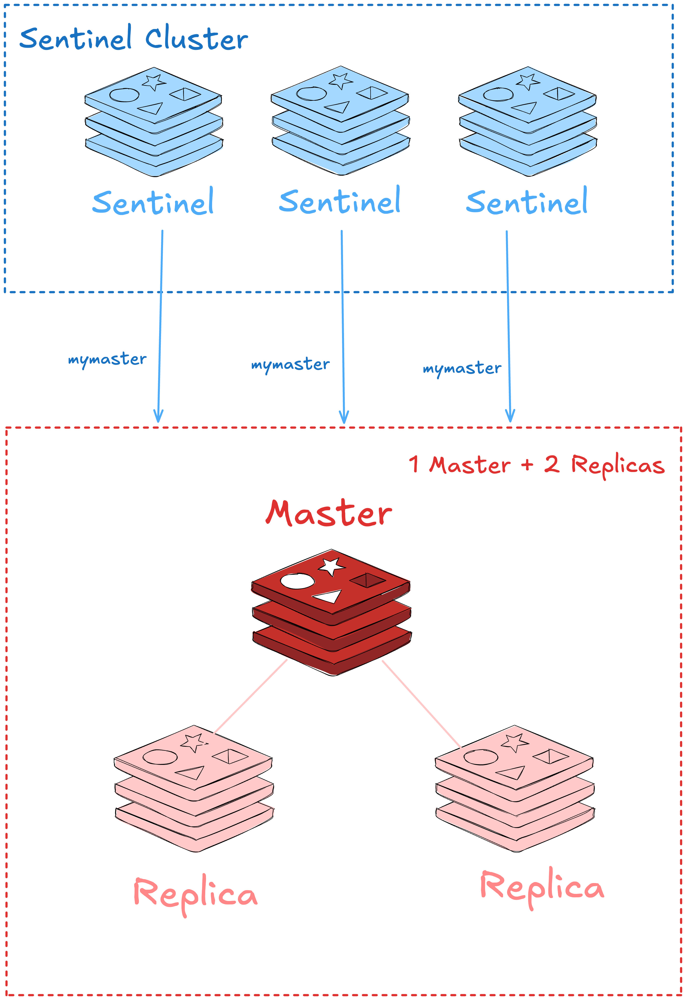
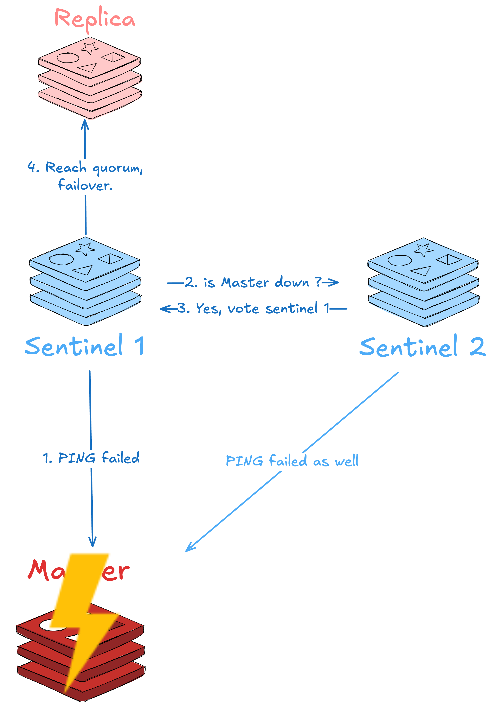

import {Tabs, TabItem, Steps} from '@astrojs/starlight/components';

## 前言
先聊一下為什麼會研究 sentinel，

某天在等下班時，

同事突然告訴我我部署的服務出現問題，

排查了一下發現是服務背後的 redis 所在節點當機，

因為一開始沒有考慮這個問題，

所以只有部署一個 single redis。

這件事之後就開始研究 redis 的高可用方案，

這篇先介紹 sentinel，cluster 等有空再寫。

這篇的重點如下
* Sentinel 是什麼
* 透過 Docker 部署實驗環境
* Sentinel 如何運作
* Client Side 如何支援

## Sentinel 是什麼

Sentinel (哨兵) 是從 redis 2.6 加入的功能，

提供非 redis-cluster 的監控以及自動的故障轉移。

Sentinel 模式下，一組 redis 會有一個 Master 配合 1 個以上的 replicas，

以下圖為例就是 1 個 Master 搭配 2 個 Replica，

而 Sentinel 本身也是一個分散式的集群，透過 Quorum 來投票，

因此官方建議 Sentinel 至少要有 3 台部署在 3 個不同的節點。

一組 Sentinel 可以拿來監測多組 master-replication 架構的 redis，

Sentinel 內部用 master name 來區分監控的 redis 是哪組，

像下圖各個 sentinel 以 `mymaster` 來辨別這組 redis。




## Quick Start

<Tabs>

<TabItem label="Docker  Compose">
<Steps>
1. 前置作業

    安裝 docker compose 

    將以下 docker-compose.yaml 貼到某個檔案下
    ```yaml title="docker-compose.yaml"
    services:
    redis-0:
        image: redis:7.0
        command: ["redis-server", "--appendonly", "yes"]
        ports:
        - "6379:6379"

    redis-1:
        image: redis:7.0
        depends_on:
        - redis-0
        command: ["redis-server", "--appendonly", "yes", "--replicaof", "redis-0", "6379"]
        ports:
        - "6380:6379"

    sentinel-0: &sentinel
        image: redis:7.0
        depends_on:
        - redis-0
        - redis-1
        command: >
        sh -c "\
            mkdir -p /etc/redis/
            echo 'sentinel monitor mymaster redis-0 6379 2' > /etc/redis/sentinel.conf && \
            echo 'sentinel resolve-hostnames yes' >> /etc/redis/sentinel.conf && \
            echo 'sentinel down-after-milliseconds mymaster 5000' >> /etc/redis/sentinel.conf && \
            redis-sentinel /etc/redis/sentinel.conf
        "

    sentinel-1: *sentinel

    sentinel-2: *sentinel
    ```


2. 透過 `docker compose` 啟動
    ```sh
    docker-compose -d -f <file> up
    ```


3. 透過 redis-cli 連線到 sentinel 

   在 container 啟動後我們可以透過 redis-cli 與 sentinel 溝通

   `26379` 是 sentinel 的 port

    底下可以任選一台 sentinel 連線進去，結果會是一樣的

    ```sh 
    docker exec -it <your sentinel container name> redis-cli -p 26379
    ```

4. 查看 sentinel 狀態

    透過 `sentinel masters` 可以查看目前所有監控的 master 狀態

    因為我們也只有監控一組 mymaster (見上方 docker compose 的設定檔)

    所以只會有 mymaster
    
    底下也看到 mymaster 這組 redis 目前 master 的 ip 以及 port
    ```sh
    127.0.0.1:26379>sentinel masters
    1) "name"
    2) "mymaster"
    3) "ip"
    4) "192.168.107.2"
    5) "port"
    6) "6379"
    ```

    實務上一組 sentinel 通常也只會監控一組 redis 

    所以 `sentinel masters` 這個指令比較少用到

    以下這幾個較常使用到

    ```sh
    # 查看目前所有監控 mymaster 的 sentinels
    sentinel sentinels mymaster
    # 查看目前 mymaster 所有的 replicas 資訊
    sentinel slaves mymaster
    # 查看目前 mymaster 的 master 資訊 
    sentinel master mymaster
    # 查看目前 mymaster 的 master 的 ip 以及 port
    sentinel get-master-addr-by-name mymaster
    ```

    這邊一些眼尖的讀者可能會有疑問

    仔細看上面 docker-compose 的設定檔 

    會發現我們只有告訴 sentinel 哪個 redis 是 mymaster 的 master

    那麼 sentinel 是怎麼知道誰是 mymaster 的 replica 呢？

    除此之外 sentinel 的設定裡面其實也沒有關於其他 sentinel 的資訊

    他們又是怎麼知道彼此的呢？

</Steps>
</TabItem>

<TabItem label="Kubernetes">
<Steps>
1. 前置作業
    * 已經安裝好 helm

    * 有 kubernetes cluster 可以操作

2. 將 bitnami 的 repo 加入 helm 並下載 chart 到 /tmp
    ```sh
    helm repo add bitnami https://charts.bitnami.com/bitnami

    helm fetch bitnami/redis --untar --untardir /tmp

    ```
3. enable sentinel  

    到剛剛下載的路徑打開 Values.yaml

    將 `sentinel enabled` 改成 true

    以及 `auth enabled` 關掉方便觀察

    ```yaml title="Values.yaml" del={2,6-7} ins={3,8-9}
    sentinel:
        enabled: false
        enabled: true
    
    auth:
        enabled: true
        sentinel: true
        enabled: false
        sentinel: false
    ```
4. 安裝 chart 

    ```sh
    helm install redis-sentinel /tmp/redis
    ```

    過個 1 分鐘查看狀態
    ```sh
    kubectl get pods

    NAME                    READY   STATUS    RESTARTS   AGE
    redis-sentinel-node-0   2/2     Running   0          120s
    redis-sentinel-node-1   2/2     Running   0          58s
    redis-sentinel-node-2   2/2     Running   0          33s
    ```

5. 查看 sentinel 狀態

    透過 `kubectl exec` 進入 sentinel 的 pod

    ```sh
    kubectl exec -it redis-sentinel-node-0 -- redis-cli -p 26379
    ```

    這邊的 port 是 sentinel 的 port

    進去後可以透過 `sentinel masters` 查看目前所有監控的 master 狀態

    bitnami 的 helm chart 預設只會監控一組 mymaster

    所以只會有 mymaster
    
    底下也看到 mymaster 這組 redis 目前 master 的 ip 以及 port
    ```sh
    127.0.0.1:26379> sentinel masters
    1)  1) "name"
        2) "mymaster"
        3) "ip"
        4) "redis-sentinel-node-0.redis-sentinel-headless.default.svc.cluster.local"
        5) "port"
        6) "6379"
        ...
    ```

    實務上一組 sentinel 通常也只會監控一組 redis

    所以 `sentinel masters` 這個指令比較少用到

    以下這幾個較常使用到

    ```sh
    # 查看目前所有監控 mymaster 的 sentinels
    sentinel sentinels mymaster
    # 查看目前 mymaster 所有的 replicas 資訊
    sentinel slaves mymaster
    # 查看目前 mymaster 的 master 資訊
    sentinel master mymaster
    # 查看目前 mymaster 的 master 的 ip 以及 port
    sentinel get-master-addr-by-name mymaster
    ```

6. 觀察 sentinel log

    bitnami 的 helm chart 是使用 statefulset 來部署 redis 以及 sentinel

    我們知道 statefulset 會從 0 號 pod 開始長

    所以理論上 0 號的 pod 會是初始的 Master 

    我們可以看看 0 號 pod 的 log 來觀察 sentinel 是如何運作的
    ```sh
    kubectl logs redis-sentinel-node-0 -c sentinel | head -n 30
    ```

    你如果仔細看會看到以下這行, sentinel 察覺到這組 redis 新增了一個 replica 

    原因是這個時候 statefulset 的第二個 pod redis-sentinel-node-1 剛啟動
    
    ```sh
    +slave slave redis-sentinel-node-1... 6379 @ mymaster redis-sentinel-node-0... 6379
    ```

    那 sentinel 是如何得知這個訊息的呢？


</Steps>
</TabItem>
</Tabs>


## Sentinel Internal

其實 sentinel 的運作原理非常簡單，

最開始啟動的時候需要指定監控的 Master IP，

接著 sentinel 就會在那個 redis master 的 pubsub 上訂閱 `__sentinel__:hello` 的 channel，

並且定時向這個 channel 發送 heartbeat 的訊息。

其他台 sentinel 啟動時也會做一樣的操作，

最終在同一個 pubsub 來動態發現彼此的存在。

至於 replica 的部分，sentinel 會直接在 master 上面執行 `INFO REPLICA` 指令來獲取目前的 replica 列表。

所以對於 redis 來說，sentinel 其實只是一個普通的 client，

我們可以在 master 或其 replica 上面透過 `pubsub channels` 查看所有 pubsub，

並透過 `subscribe __sentinel__:hello` 來訂閱這個 channel。
```sh
127.0.0.1:6379> pubsub channels
1) "__sentinel__:hello"
127.0.0.1:6379> subscribe __sentinel__:hello
1) "subscribe"
2) "__sentinel__:hello"
3) (integer) 1
1) "message"
2) "__sentinel__:hello"
3) "192.168.194.50,26379,5f4ff5b1f3024ce375ab027ac24adb717305f02c,0,mymaster,redis-sentinel-node-0.redis-sentinel-headless.default.svc.cluster.local,6379,0"
1) "message"
2) "__sentinel__:hello"
3) "192.168.194.50,26379,5f4ff5b1f3024ce375ab027ac24adb717305f02c,0,mymaster,redis-sentinel-node-0.redis-sentinel-headless.default.svc.cluster.local,6379,0"
1) "message"
2) "__sentinel__:hello"
3) "192.168.194.51,26379,6b28db582bd8af66c1e0ddbcc9afcce2daba4354,0,mymaster,redis-sentinel-node-0.redis-sentinel-headless.default.svc.cluster.local,6379,0"
...
```

可以看到上面 sentinel 會在 pubsub 中留下自己的資訊，格式如下：

`sentinel ip, sentinel port, sentinel id, sentinel epoch, master name, master ip, master port, master epoch`。

有了這些資訊其他 sentinel 就可以連線到彼此，形成一個分散式集群。

:::note
當你今天透過 `info clients` 指令查看 redis 的 client 時，

會發現連線數會比你預期的多，以上面的配置來說，可能會看到 8~9 個連線。

有這麼多是因為 replica 與 master 彼此之間有連線，

sentinel 也會與 master 以及 replica 之間有連線，

而且一台 sentinel 會與一個 redis 有 2 個連線，

一個是用來訂閱的連線，另一個是用來向 redis 發送命令的連線。
:::
## 故障轉移

上面講 sentinel 的運作原理，這小節講述 sentinel 是怎麼處理故障轉移的。

當其中一台 sentinel 偵測到 master 當機時，會將該 master 標示為主觀下線，

並開始進行故障轉移的程序。

:::note
sentinel 每秒會向 master 以及 replica 發送 ping 指令來確認是否存活，

若超過了參數 `down-after-milliseconds` 設定的時間沒有回應，

則會將該 redis 標示為主觀下線 (subjectively down, SDOWN)。

`down-after-milliseconds` 的預設值是 60s。
:::

故障轉移的過程會由某台 sentinel 發起投票，

詢問其他 sentinel 是否也觀測到這台 redis 當機。

若其他 sentinel 也認同當機，則會把票投給詢問的 sentinel，

一但達到 quorum 的票數，則判定為客觀下線，

這時候會從所有的 replica 中選出一台來升級為 master，

並將其他的 replica 指向新的 master。


:::note
sentinel 將 replica 的升級為 master 的方式非常簡單，

就是直接對他下達 `SLAVEOF NO ONE` 的指令。
:::

## Client Side Support

聊完了 sentinel 的運作原理以及如何故障轉移，

最後想來講 client side 該怎麼支援。

若你只有連線過單機的 redis，

可能覺得怪怪的，故障轉移很好，但 client library 怎麼知道要連線到新的 master 呢？

以下我們以 go-redis 為例，來看看他是怎麼做的。

在 go-redis 中，是透過 `NewFailoverClient` 來與 redis 連線，

並且給他所有 sentinel 的 addresses。

`masterReplicaDialer` 就是用來連線到 redis 的 dialer。

```go
func NewFailoverClient(failoverOpt *FailoverOptions) *Client {
	
	...
	failover := &sentinelFailover{
		opt:           failoverOpt,
		sentinelAddrs: sentinelAddrs,
	}

	opt := failoverOpt.clientOptions()
	opt.Dialer = masterReplicaDialer(failover)
	opt.init()

}

func masterReplicaDialer(
	failover *sentinelFailover,
) func(ctx context.Context, network, addr string) (net.Conn, error) {
	return func(ctx context.Context, network, _ string) (net.Conn, error) {
		var addr string
		var err error
		...

			addr, err = failover.MasterAddr(ctx)

		...
	}
}
```
可以看到這個 `masterReplicaDialer` 最後呼叫了 `failover.MasterAddr` 來獲取最開始的 master 的地址，

這個方法會遍歷所有的 sentinel，並且向他們詢問目前的 master 是誰。

一但問到 master 的地址就會回傳，但在回傳前會在呼叫 `setSentinel` 。
```go
// from go-redis sentinel.go
func (c *sentinelFailover) MasterAddr(ctx context.Context) (string, error) {
	...
	for i, sentinelAddr := range c.sentinelAddrs {
		sentinel := NewSentinelClient(c.opt.sentinelOptions(sentinelAddr))

		masterAddr, err := sentinel.GetMasterAddrByName(ctx, c.opt.MasterName).Result()
		if err != nil {
            ...
		}

		// Push working sentinel to the top.
		c.sentinelAddrs[0], c.sentinelAddrs[i] = c.sentinelAddrs[i], c.sentinelAddrs[0]
		c.setSentinel(ctx, sentinel)

		addr := net.JoinHostPort(masterAddr[0], masterAddr[1])
		return addr, nil
	}
}

```

那這個 `setSentinel` 是做什麼的呢？

他其實就是一個 go-routine 來監聽 sentinel 的 pubsub，

當 sentinel 在執行故障轉移時，會在自身的 pubsub 上面發送 `+switch-master` 的訊息，

這時候 go-redis 的 client 就會收到這個訊息，並且呼叫 `trySwitchMaster` 來更新目前的 master 地址。
```go
// from go-redis sentinel.go
func (c *sentinelFailover) setSentinel(ctx context.Context, sentinel *SentinelClient) {
	
	...
	c.pubsub = sentinel.Subscribe(ctx, "+switch-master", "+replica-reconf-done")
	go c.listen(c.pubsub)
}


func (c *sentinelFailover) listen(pubsub *PubSub) {
	ctx := context.TODO()


	ch := pubsub.Channel()
	for msg := range ch {
		if msg.Channel == "+switch-master" {
            ...
			c.trySwitchMaster(pubsub.getContext(), addr)
		}
	}
}
```


## Clean Up 
最後別忘了清除實驗環境😱。

<Tabs>
<TabItem label="Docker  Compose">
```sh
docker compose -f <file> down
```
</TabItem>

<TabItem label="Kubernetes">
```sh
helm uninstall redis-sentinel
```
</TabItem>
</Tabs>